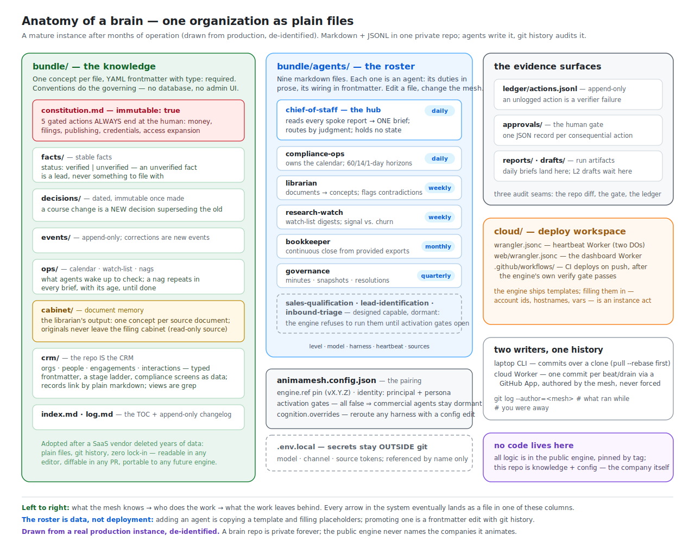
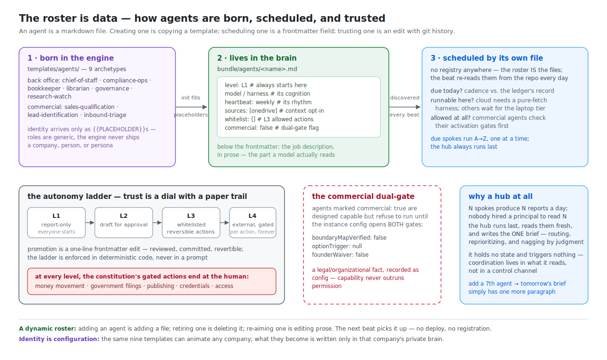

# A typical brain — what one company looks like on AnimaMesh

*A guided tour of a real production instance, de-identified. The engine's
half of the story is [architecture.md](architecture.md); the path to
building your own is [starting-a-company.md](starting-a-company.md). This
page is the show-and-tell: what the files actually look like after months
of operation.*

## The repo is the company

A brain is one private git repo with **no code in it** — knowledge and
configuration only, animated by the pinned public engine. Read the diagram
left to right:

- **What the mesh knows** (`bundle/`): one concept per markdown file, typed
  by frontmatter. The constitution's hard limits are machine-read by the
  gates; facts carry a `verified`/`unverified` status so an agent can tell
  a checked fact from a lead; decisions are dated and immutable — changing
  course means a *new* decision superseding the old, so the reasoning trail
  never rewrites itself.
- **Who does the work** (`bundle/agents/`): the roster, as files. More
  below.
- **What the work leaves behind** (`ledger/`, `approvals/`, `reports/`,
  `drafts/`): three audit seams — the repo diff (what changed), the
  approvals gate (what waits for a human), and the append-only ledger (what
  the mesh did). An unlogged action is a verifier failure, not a style
  violation.

Two details visitors usually don't expect:

- **The CRM is folders of markdown.** Organizations, people, engagements,
  and interactions are typed concepts with a stage ladder and compliance
  screens encoded *in the data*; views are grep. This instance adopted the
  pattern after a SaaS vendor deleted years of relationship history —
  plain files under git can't be taken away.
- **Two writers share the repo.** The laptop CLI and the cloud Worker both
  commit (the cloud as its own author identity, one commit per beat or
  direction drain, never forced). `git log --author=<mesh>` is literally
  "what did the company do while I was away".

## The roster is data

This instance runs **nine agents, all defined as markdown files**: six
back-office (hub + five spokes at daily/weekly/monthly/quarterly rhythms)
and three commercial agents that are fully written but **dormant** — the
engine refuses to run `commercial: true` agents until the instance's
activation gates open. Capability is built ahead of permission and then
*waits* for it, with the waiting enforced in code.

The dynamic-roster property falls out of file-ness: the beat re-discovers
the roster from the repo every day, so adding an agent is copying a
template and filling placeholders, retiring one is deleting a file, and
promoting one up the autonomy ladder (L1 report-only → L4 external-gated)
is a one-line frontmatter edit with git history as the promotion record.
There is no agent registry, no deployment step, and no orchestrator to
reconfigure — see [heartbeat-anatomy.md](heartbeat-anatomy.md) for why the
hub coordinates by *reading* rather than *commanding*.

Cognition is per-agent too: each file declares `model` + `harness`, and the
instance config's `cognition.overrides` can reroute a harness at runtime —
this instance once redirected its default vendor to another provider
during an outage with a two-line config edit, no agent files touched.

## A day in the life

What the principal actually experiences, on a day the laptop stays closed:

1. **08:00 local** — the cloud beat fires. Due spokes run first (on their
   own rhythms — most days that's one or two; Mondays add the weekly
   agents), the hub runs last and writes the brief.
2. **08:0x** — one commit lands in the brain repo:
   `beat(cloud): 2026-07-19 — 3 run(s), 0 failure(s)`. Only after it lands
   does the brief arrive as a Discord DM — evidence before words.
3. **Over coffee** — the brief leads with the nags (the principal opted
   into being bugged), then: what happened, what needs a decision today
   with the specific approve/edit ask, what the spokes do next. When a
   spoke's work needs follow-through faster than its own cadence, the brief
   ends with a `schedule-request` that wakes that agent for the next beat —
   applied through the hub's whitelist gate, ledgered, and visible in the
   same commit. (In this instance's first hour with the capability, the hub
   woke the bookkeeper because a filing-decision deadline outpaced its
   monthly rhythm — exactly the judgment the mechanism exists for.)
4. **Any time** — the principal answers with `/direct …` in the same DM.
   Seconds later a direction drain runs agentically, commits its evidence
   (`direction: 1 processed`), and replies.
5. **Silence otherwise** — failures DM the principal by name and stage;
   no DM means the mesh is healthy, and `/healthz` will confirm it.

The git history reads like a company diary — beats, direction drains, and
deliberate human commits interleaved, every one attributable.

## What transfers, what doesn't

Everything structural on this page — the bundle conventions, the roster
mechanics, the ladder, the gates, the two-writer model — ships in the
engine and transfers to any company. What doesn't transfer is everything
that made this instance *itself*: its facts, decisions, persona, and
coordinates, which stay private forever. Standing up your own copy of this
shape takes an afternoon: [starting-a-company.md](starting-a-company.md),
or let the `brain-setup` skill interview you (`.claude/skills/brain-setup/`
in this repo) and scaffold it for you.
