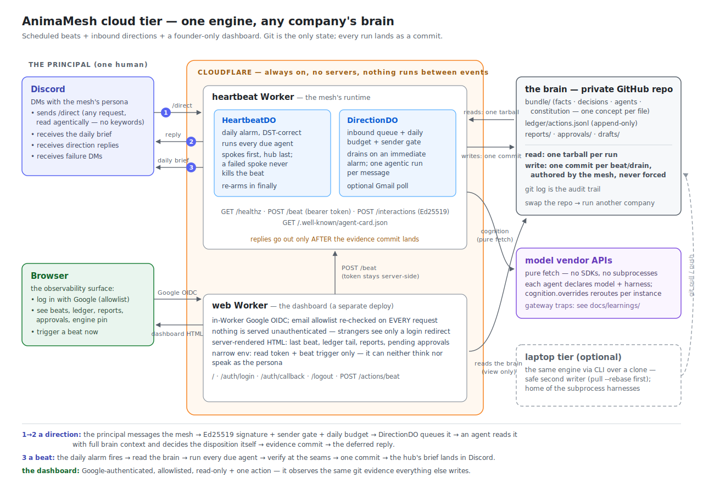

# Architecture — the whole system on one page

*The reference map for anyone — human or AI — operating or extending
AnimaMesh. Module-level detail lives in [src/README.md](../src/README.md);
this page is the system view.*

## The pieces

**Two repos, one-way dependency.** The public **engine** (this repo) holds
all logic; a private **brain** repo holds one company's knowledge, config,
and deploy workspace, and pins the engine by git tag. The full sorting rule:
[engine-vs-instance.md](engine-vs-instance.md).

**One brain, two runtimes.** The same harness runs from a laptop CLI over a
local clone, or from Cloudflare Workers over the GitHub-hosted brain. The
`InstanceStore` seam (`store-fs` / `store-github`) is the only difference:
cloud runs read the instance as **one tarball** and land all artifacts as
**one commit** (never force-pushed). Both writers can coexist — the CLI
pulls `--rebase` before writing, the cloud store re-snapshots once on a
moved ref and otherwise fails loudly.

**The heartbeat Worker** hosts two Durable Objects:

- `HeartbeatDO` — one durable alarm, recomputed daily in the instance's
  timezone (DST-correct — the reason it's an alarm, not a UTC cron). A beat
  = read brain → run every due agent whose *effective* harness is
  fetch-capable (`CLOUD_HARNESSES`) → verify at the seams → one commit →
  deliver the hub's brief → failure DM if anything broke. The alarm re-arms
  in `finally`; a crashed beat can't silence tomorrow.
- `DirectionDO` — the inbound queue. Holds the per-day budget counter, the
  processed-message dedup ring for polled channels, and an immediate alarm
  that drains the queue agentically.

**The web Worker** is a separate, narrower deploy: Google OIDC in-Worker,
email allowlist re-checked per request, a server-rendered dashboard over
the same GitHub evidence, and exactly one action (trigger a beat). It holds
no cognition or persona secrets — see
[workers/web/README.md](../workers/web/README.md).

**Cognition** crosses one seam: `AgentWorkerProvider`. Each agent concept
declares `model` + `harness`; the instance config's `cognition.overrides`
can reroute a declared harness at runtime (vendor trouble = config edit).
Cloud-capable providers are pure fetch (`moonshot-api`, `anthropic-api`);
subprocess providers (`claude-code`, `claude-agent-sdk`, `opencode`) are
laptop-tier by architecture. Vendor gateway traps are documented with
evidence in [learnings/](learnings/README.md).

**External context** crosses a separate, read-only seam. An agent opts in with
`sources:` in its concept frontmatter; prompt assembly fetches a current listing
from `onedrive` (Microsoft Graph) or `github-docs` (GitHub REST in Workers, or a
local working tree on the Node tier) and inlines it before cognition runs.
Source adapters cannot write. An unavailable source becomes an explicit gap in
the prompt instead of aborting the run or inviting the model to guess. The
current prompt surface includes listing metadata, not document bodies.
Operators can validate the cloud adapters through the bearer-gated
`GET /graph/check` and `GET /docs/check` routes.

## How Discord messages flow (both directions)

**Inbound — a direction (flows ① and ② on the diagram):**

1. The principal runs `/direct <message>` in the persona's DM. Discord POSTs
   to the Worker's `/interactions` with an Ed25519 signature; the Worker
   verifies it against the app's public key (bad signature → 401 — Discord
   also probes this with PINGs, answered PONG).
2. The **sender gate**: only the configured principal id is accepted.
   Strangers get a silent 202 and a ledgered `/denied` record — no
   information leaks about what this endpoint is.
3. The **budget**: a per-ET-day counter in `DirectionDO`; over cap → an
   ephemeral "budget spent" reply, and the message is not queued.
4. Accepted: the Worker answers Discord with a **deferred reply** (type 5,
   "thinking…"), enqueues the message, and sets the DO alarm to *now*.
5. The alarm drains the queue: each message becomes one
   `runDirectionCore` run — the agent reads the message **with full bundle
   context and decides the disposition itself** (answer, recommend, flag,
   or "nothing needs doing"); there is no keyword routing anywhere.
6. Evidence lands first: report artifact + `direction-*` ledger entries in
   **one commit per drain**. Only then does the Worker send the real reply
   through the interaction followup webhook. A failed run still ledgers the
   principal's words (`direction-failed` keeps the message text) and says so
   honestly in the reply.

Two deliberate namings keep directions from corrupting the daily rhythm:
ledger actions are `direction-*` (never `run-*`, so the heartbeat's
"already ran today" dedup ignores them) and artifacts are
`{date}-{agent}.direction-{runid}.md` (the dot keeps brief delivery blind
to them).

**Outbound — the daily brief (flow ③):** the beat's last agent is the hub;
its report is delivered as a Discord bot DM (or Notion/Gmail/console — the
channel registry is pluggable). Failure DMs use the same path: silence must
mean success.

**Inbound — email:** the same `DirectionDO` alarm optionally polls a Gmail
inbox (`from:<principal> is:unread`), re-checks the sender client-side,
dedups by message id, and feeds the same direction pipeline. Poll cadence
and allowed sender are instance vars; unset = off.

## Design constraints (load-bearing, do not relax)

- **No streaming, no SSE, no WebSockets** — Durable Objects bill idle
  wall-clock; everything is short request/response. The agent card says
  `streaming: false` on purpose.
- **Git is the only durable knowledge and evidence store.** No R2/D1/KV. If it
  matters after a run, it's a commit. DO storage is deliberately limited to
  control state: alarms, locks, the direction queue, budgets, and dedup rings.
- **Evidence before words.** A reply that isn't backed by a commit is a
  hallucination with a send button.
- **Safety in code, never prompts** — gates, ladder, ledger, verifiers are
  deterministic; everything between wake-up and gate is model judgment.
- **One commit per beat/drain**, authored by the mesh's identity, never
  forced — `git log` stays a readable audit trail.

## Testing the whole thing

Every layer has a local, deterministic harness: workerd-local suites for
both Workers (`@cloudflare/vitest-pool-workers` with mocked GitHub/Discord/
vendor edges), the engine regression suite with the `fake` provider, a
golden-day flight recorder, and env-gated live seams (`LIVE_*`) for real
vendors. `pnpm verify` runs all of it. See [test/README.md](../test/README.md).
