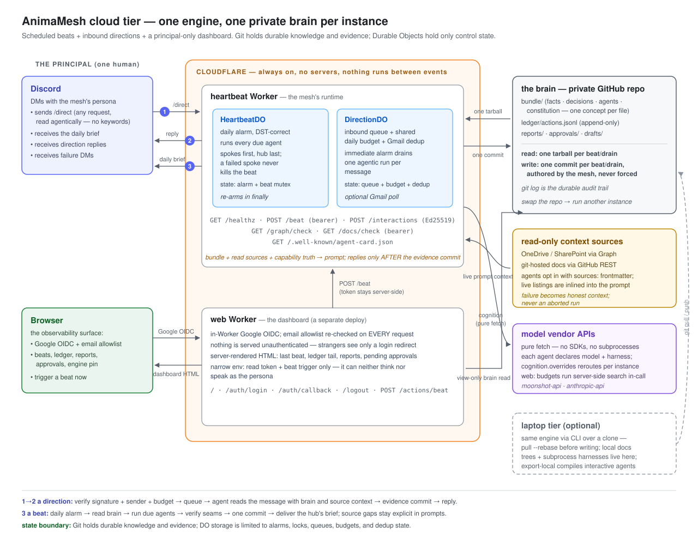

# Architecture — the whole system on one page

*The reference map for anyone — human or AI — operating or extending
AnimaMesh. Module-level detail lives in [src/README.md](../src/README.md);
this page is the system view.*

## The pieces

**Two repos, one-way dependency.** The public **engine** (this repo) holds
all logic; a private **brain** repo holds one company's knowledge, config,
and deploy workspace, and pins the engine by git tag. The full sorting rule:
[engine-vs-instance.md](engine-vs-instance.md).

**One brain, three surfaces.** The same harness runs from a laptop CLI over
a local clone, or from Cloudflare Workers over the GitHub-hosted brain. The
`InstanceStore` seam (`store-fs` / `store-github`) is the only difference:
cloud runs read the instance as **one tarball** and land all artifacts as
**one commit** (never force-pushed). Both writers can coexist — the CLI
pulls `--rebase` before writing, the cloud store re-snapshots once on a
moved ref and otherwise fails loudly.

The third surface is **interactive**: `export-local` compiles any agent
concept into `.claude/agents/` and `.opencode/agents/` artifacts, so the
persona that writes the daily brief is also a conversation in a coding
terminal — same concept file, gates and ladder binding unchanged, the
bundle read-only in sessions. Details in [local-agents.md](local-agents.md).

**The heartbeat Worker** hosts two Durable Objects:

- `HeartbeatDO` — one durable alarm, recomputed daily in the instance's
  timezone (DST-correct — the reason it's an alarm, not a UTC cron). A beat
  = read brain → run every due agent whose *effective* harness is
  fetch-capable (`CLOUD_HARNESSES`) → verify at the seams → one commit →
  deliver the hub's brief → failure DM if anything broke. The alarm re-arms
  in `finally`; a crashed beat can't silence tomorrow. The step-by-step
  walkthrough, with the sequence diagram, is
  [heartbeat-anatomy.md](heartbeat-anatomy.md).
- `DirectionDO` — the inbound queue. Holds the per-day budget counter, the
  processed-message dedup ring for polled channels, and an immediate alarm
  that drains the queue agentically.

**The web Worker** is a separate, narrower deploy: Google OIDC in-Worker,
email allowlist re-checked per request, a server-rendered dashboard over
the same GitHub evidence, and exactly one action (trigger a beat). It holds
no cognition or persona secrets — see
[workers/web/README.md](../workers/web/README.md).

**Cognition** crosses one seam: `AgentWorkerProvider`. Each agent concept
declares `model` + `harness`; the instance config's `cognition.overrides`
can reroute a declared harness at runtime (vendor trouble = config edit).
Cloud-capable providers are pure fetch (`moonshot-api`, `anthropic-api`);
subprocess providers (`claude-code`, `claude-agent-sdk`, `opencode`) are
laptop-tier by architecture. Vendor gateway traps are documented with
evidence in [learnings/](learnings/README.md).

Every provider also declares **capabilities** — `fileReads` and `webSearch` —
and prompt assembly states them to the agent verbatim, after its job
description and explicitly overriding it. This is not documentation for its
own sake: an agent whose job budgeted "~8 web fetches" while its harness sent
no tools at all could not tell a missing capability from a broken one, and
twice reported a tool failure for a tool that never existed
([issue #4](https://github.com/jackzhaojin/anima-mesh/issues/4)). Providers
under-claim by default — undeclared reads as "grants nothing", because a
wasted sentence of prompt is cheaper than a fabricated week of research.

**Web search** is the one capability an agent requests: `web: <n>` in concept
frontmatter budgets *n* searches per run. The harness reconciles that request
against the resolved provider and tells the agent which answer it got, so a
budget on a harness that cannot search produces a loud, reported gap rather
than a silent empty result. On `anthropic-api` the searches run **server-side
inside the Messages call** (`web_search_20250305`), which is why the cloud
tier has real external checks without a client tool loop; paused turns are
continued, and a gateway that refuses the tool degrades the run — correcting
the agent mid-prompt and marking `degraded` — instead of failing the beat.

**External context** crosses a separate, read-only seam. An agent opts in with
`sources:` in its concept frontmatter; prompt assembly fetches a current listing
from `onedrive` (Microsoft Graph) or `github-docs` (GitHub REST in Workers, or a
local working tree on the Node tier) and inlines it before cognition runs.
Source adapters cannot write. An unavailable source becomes an explicit gap in
the prompt instead of aborting the run or inviting the model to guess. The
current prompt surface includes listing metadata, not document bodies.
Operators can validate the cloud adapters through the bearer-gated
`GET /graph/check` and `GET /docs/check` routes.

**Role-declared reads** close the loop inside the instance itself: `reads:` in
concept frontmatter names the files and directories (bundle-relative first,
instance-root fallback — drafts live beside the bundle) an agent must see every
run beyond the standard excerpts. Prompt assembly inlines each one, and a path
it cannot serve becomes an explicit NOT AVAILABLE marker, never a silent
omission. Before this seam existed, a hub whose role prose required a pipeline
view, a CRM directory, and a drafts subdirectory got none of them on a no-tool
harness and could only infer the gap by diffing its own job description against
its context ([issue #5](https://github.com/jackzhaojin/anima-mesh/issues/5)) —
"nothing to report" and "wasn't given the data" must stay distinguishable
facts, stated in the prompt.

The same honesty applies to the scheduler: a cloud beat that skips a DUE
laptop-tier agent computes what its due decision would have been and hands
the hub **beat notes** — a prompt section naming each blocked agent and the
manual local run that unblocks it — so the brief nags the principal instead
of letting the missing report pass as a quiet day.

## How Discord messages flow (both directions)

**Inbound — a direction (flows ① and ② on the diagram):**

1. The principal runs `/direct <message>` in the persona's DM. Discord POSTs
   to the Worker's `/interactions` with an Ed25519 signature; the Worker
   verifies it against the app's public key (bad signature → 401 — Discord
   also probes this with PINGs, answered PONG).
2. The **sender gate**: only the configured principal id is accepted.
   Strangers get a silent 202 and a ledgered `/denied` record — no
   information leaks about what this endpoint is.
3. The **budget**: a per-ET-day counter in `DirectionDO`; over cap → an
   ephemeral "budget spent" reply, and the message is not queued.
4. Accepted: the Worker answers Discord with a **deferred reply** (type 5,
   "thinking…"), enqueues the message, and sets the DO alarm to *now*.
5. The alarm drains the queue: each message becomes one
   `runDirectionCore` run — the agent reads the message **with full bundle
   context and decides the disposition itself** (answer, recommend, flag,
   or "nothing needs doing"); there is no keyword routing anywhere.
6. Evidence lands first: report artifact + `direction-*` ledger entries in
   **one commit per drain**. Only then does the Worker send the real reply
   through the interaction followup webhook. A failed run still ledgers the
   principal's words (`direction-failed` keeps the message text) and says so
   honestly in the reply.

Two deliberate namings keep directions from corrupting the daily rhythm:
ledger actions are `direction-*` (never `run-*`, so the heartbeat's
"already ran today" dedup ignores them) and artifacts are
`{date}-{agent}.direction-{runid}.md` (the dot keeps brief delivery blind
to them).

**Outbound — the daily brief (flow ③):** the beat's last agent is the hub;
its report is delivered as a Discord bot DM (or Notion/Gmail/console — the
channel registry is pluggable). Failure DMs use the same path: silence must
mean success. Long reports are never truncated: anything over Discord's
message ceiling is split at paragraph boundaries and sent as sequential
messages (`CONTENT_LIMIT` 1900 in `src/channels/discord.ts`).

**Inbound — email:** the same `DirectionDO` alarm optionally polls a Gmail
inbox (`from:<principal> is:unread`), re-checks the sender client-side,
dedups by message id, and feeds the same direction pipeline. Poll cadence
and allowed sender are instance vars; unset = off.

## Design constraints (load-bearing, do not relax)

- **No streaming, no SSE, no WebSockets** — Durable Objects bill idle
  wall-clock; everything is short request/response. The agent card says
  `streaming: false` on purpose.
- **Git is the only durable knowledge and evidence store.** No R2/D1/KV. If it
  matters after a run, it's a commit. DO storage is deliberately limited to
  control state: alarms, locks, the direction queue, budgets, and dedup rings.
- **Evidence before words.** A reply that isn't backed by a commit is a
  hallucination with a send button.
- **Safety in code, never prompts** — gates, ladder, ledger, verifiers are
  deterministic; everything between wake-up and gate is model judgment.
- **Model proposes, code disposes — three write paths, all gated.** A run's
  output can carry exactly three kinds of write request as fenced blocks:
  `schedule-request` (wake an agent), `draft-request` (write under the
  drafts dir), and `defect-report` (file an engine bug). Each is parsed,
  checked against the same ladder-level + whitelist gate, and ledgered
  whether applied or denied — no acknowledged-but-unapplied state can exist.
- **The defect loop is the one deliberate outward path** across the
  public/private boundary: leak-clean reports file as public engine-repo
  issues. The identity-leak guard **denies, never rewrites** — a report
  naming a person or org stays private for a human to clean, because a
  guard that edits text is a guard you can't audit.
- **One commit per beat/drain**, authored by the mesh's identity, never
  forced — `git log` stays a readable audit trail.

## Testing the whole thing

Every layer has a local, deterministic harness: workerd-local suites for
both Workers (`@cloudflare/vitest-pool-workers` with mocked GitHub/Discord/
vendor edges), the engine regression suite with the `fake` provider, a
golden-day flight recorder, and env-gated live seams (`LIVE_*`) for real
vendors. `pnpm verify` runs all of it. See [test/README.md](../test/README.md).
