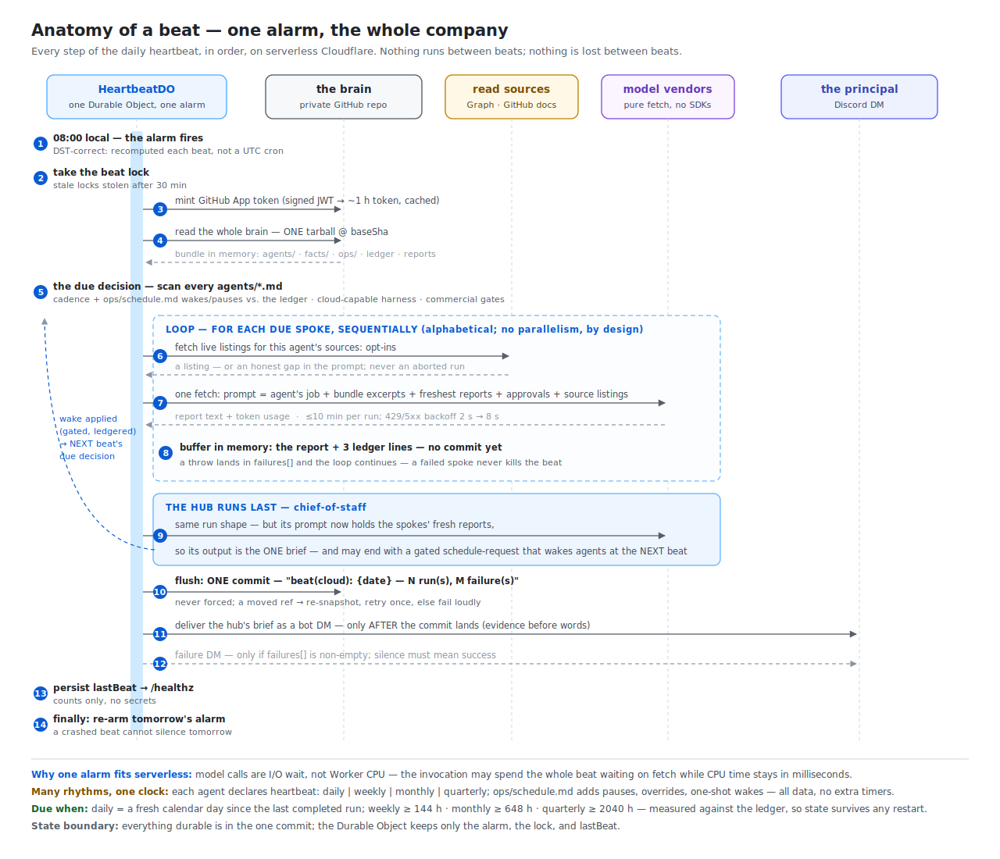

# Anatomy of a beat — how the heartbeat really works

*The system view is [architecture.md](architecture.md); this page slows one
daily beat down to its individual steps and explains why each one is shaped
for a serverless platform. Code pointers are at the bottom.*



## One alarm, not a cron

The daily beat is a **Durable Object alarm**, deliberately not a Workers cron
trigger. A cron fires at a fixed UTC time; the beat must fire at a fixed
*local* time (`BEAT_HOUR` in `BEAT_TIMEZONE`), which drifts against UTC twice
a year. `nextBeatUtc()` recomputes the next fire instant from scratch on
every re-arm with a two-pass `Intl` offset convergence — DST-correct with
zero dependencies.

Three properties make the alarm trustworthy:

- **Anything arms it.** Every inbound request ensures the alarm exists
  (idempotent), so the first `/healthz` after a deploy is enough to schedule
  tomorrow. Alarms survive deploys and isolate evictions.
- **It re-arms in `finally`.** Success, failure, or crash, the next beat is
  scheduled before the invocation ends — a crashed beat cannot silence
  tomorrow.
- **A mutex guards the run.** A `beat-running` lock keeps a manual
  `POST /beat` from double-running alongside the alarm. The manual beat is
  detached from the request (202 + run marker; `/healthz` reports
  completion), so a deploy or disconnect mid-beat can't strand the lock: a
  lock whose isolate died is journaled as an interrupted beat and reclaimed
  by the next request.

## The due decision — many rhythms, one clock

The user-visible behavior is "agents run at different times": the
chief-of-staff daily, the librarian weekly, the bookkeeper monthly, the
governance agent quarterly. The mechanism is **not** per-agent timers. There
is exactly one clock — the daily alarm — and cadence is *data in each
agent's frontmatter* (`heartbeat: daily | weekly | monthly | quarterly`).
Every beat re-reads the roster from the repo (`bundle/agents/*.md` — no
registry, no deploy step) and asks three questions per agent:

1. **Due?** Compare the cadence against the ledger's last `run-completed`
   entry for this agent. `daily` means "a fresh calendar day", not "20 hours
   elapsed" — so a late-night manual run can't eat the next morning's brief.
   Weekly/monthly/quarterly are elapsed-hours thresholds (144 h / 648 h /
   2040 h). Because the comparison is against the **ledger**, not in-memory
   state, the schedule survives restarts, deploys, and tier switches.
2. **Runnable here?** In the cloud, only agents whose *effective* harness
   (after `cognition.overrides`) is pure-fetch can run; subprocess harnesses
   wait for the laptop tier. The same beat logic runs on both tiers.
3. **Allowed at all?** `commercial: true` agents check the instance's
   activation gates first and are skipped — not errored — while the gates
   are closed.

The payoff of cadence-as-data: an instance can retune its whole rhythm by
editing frontmatter, and a brain restored from backup knows exactly what is
due because the ledger came with it.

### The schedule surface — pauses, overrides, and one-shot wakes

Frontmatter cadence is the *standing* rhythm; `ops/schedule.md` is the
*mutable* control surface layered over it, read by the same due decision:

- **`wake:`** — run these agents at the next beat regardless of cadence
  (even agents with no `heartbeat:` at all). A wake is **consumed on
  attempt** — removed from the file in the beat's own commit, so request
  and fulfillment sit adjacent in git history and nothing double-fires. A
  wake the beat *couldn't* honor (laptop-tier harness in a cloud beat,
  closed commercial gates) is deliberately kept: it belongs to whichever
  tier and permission state can run it, and a sticky wake for a *failing*
  agent is deliberately **not** kept — the failure DM tells the principal,
  who re-wakes on purpose rather than letting a retry loop spam a vendor.
  One more nuance, found in the first live beat: a wake **renewed
  mid-beat** — the hub runs last and may re-wake a spoke that already ran,
  having just read its report — is a request about the *next* beat and
  survives consumption (renewals are recognized from the beat's own
  `schedule-updated` ledger entries).
- **`pause:`** — skip these agents until removed. Pause beats wake: an
  explicit stop outranks an explicit go, and the contradiction stays
  visible in the file instead of resolving silently.
- **`cadence:`** — per-agent override of the declared `heartbeat:`
  (declared-vs-effective, the same pattern as `cognition.overrides`).

Next-fire time is never stored here — it stays derived from cadence plus
the ledger, so there is no second source of truth to drift.

This is also the **manual trigger**: edit `wake:`, commit, then either wait
for the alarm or `POST /beat`. And it is how a *hub reviews work and
schedules the follow-through*: an agent whose whitelist includes
`schedule-update` may end its report with a fenced block —

~~~
```schedule-request
wake: [agent-name]
```
~~~

— which the harness applies **through the same gate as every reversible
action** (ladder level + whitelist, checked in code), ledgered as
`schedule-updated`, or ledgered as `schedule-request-denied` and left
visible in the report when the gate says no. Model judgment proposes;
deterministic code disposes. Self-wakes are dropped (an agent that wakes
itself daily is a loop), and unknown names never enter the file.

## Spokes first, hub last — coordination without a control channel

A natural guess is that the chief-of-staff "triggers" the other agents. It
doesn't — and that's the design insight worth stealing. The scheduler runs
every due agent directly, **sequentially**: spokes in alphabetical order,
the hub forced last. Each spoke's run buffers a report; when the hub runs,
prompt assembly inlines the freshest reports — so the hub *reads* the day's
work rather than *commanding* it, and its output is the one brief the
principal sees.

The hub is special only by sort order and by being the default delivery
agent. Structurally it is one more markdown file at L1. Coordination lives
in what it reads, not in a control channel — which means there is no
orchestration state to corrupt, no half-finished workflow to resume, and
adding an agent changes tomorrow's brief without touching any coordinator
code.

Sequential execution is deliberate, not a limitation to fix later:

- the hub-last ordering requires the spokes to have finished;
- one vendor call at a time keeps 429s (and their backoff) from compounding;
- a failure is attributable to exactly one agent;
- and parallelism would save little — the beat's wall-clock is model
  latency, which the platform bills as I/O wait, not CPU.

## How a "long" beat fits a serverless platform

A beat can spend many minutes working, on a platform famous for
short-request thinking. The engine's answer is to make the beat cheap in the
dimension the platform actually constrains:

- **CPU vs. wall-clock.** Model calls are `fetch`es; while they're in
  flight the Worker burns no CPU. A Durable Object alarm invocation may
  wait on I/O far beyond a typical request's lifetime, so the whole beat
  runs in **one** invocation — no alarm chaining, no queues, no
  `waitUntil` relays. Boring on purpose: every continuation mechanism
  removed is a failure mode removed.
- **Bounded per-agent cost.** Each provider call carries a 10-minute
  `AbortSignal.timeout` and short in-provider retries (2 s → 8 s, honoring
  `retry-after`). A hung vendor costs one agent its run, never the beat.
- **Subrequests are budgeted.** The brain is read as **one tarball** at a
  pinned SHA, the GitHub App token is minted once and cached, and all
  writes buffer in memory until the end.
- **State never lives in the invocation.** If the isolate dies mid-beat,
  durable truth is unchanged (the commit hasn't happened), the lock goes
  stale and is stolen, and the alarm re-arms. The worst case is a missing
  beat commit — visible, recoverable, and reported.

## The failure ladder

Failure handling is layered so that each blast radius stays one size:

| Failure | Blast radius | Behavior |
|---|---|---|
| One spoke throws | that agent | recorded in `failures[]`, loop continues — a failed spoke never kills the beat |
| Any failures at end | none (informational) | the commit still lands; a failure DM lists them — silence must mean success |
| Beat-level throw (auth, store, flush) | the beat | failure DM names the stage; alarm still re-arms in `finally` |
| Flush ref conflict (another writer won) | the flush | re-snapshot, recompose, retry **once**, else fail loudly — never force-push |
| Concurrent trigger | none | beat mutex; stale locks stolen after 30 min |

## What a beat leaves behind

Exactly one commit — `beat(cloud): {date} — N run(s), M failure(s)` —
containing, per agent run: the report artifact
(`reports/{date}-{agent}-{runid}.md`) and three ledger appends
(`run-started`, `report-written`, `run-completed`). The DO keeps only
`lastBeat` for `/healthz` counts. Everything durable is in git; the
observability story is `git log` first, dashboard second.

## The other pulse: directions

Inbound directions (`/direct` on Discord, or the polled inbox) use the same
run machinery on a **second** Durable Object with an *immediate* alarm — a
message enqueues and drains in seconds, not at 08:00. Two namings keep the
pulses from interfering: direction ledger actions are `direction-*` (so the
beat's "already ran today" check ignores them) and direction artifacts carry
a `.direction-` infix (so brief delivery is blind to them). Full flow in
[architecture.md](architecture.md#how-discord-messages-flow-both-directions).

## Where the code lives

| Step | Code |
|---|---|
| Alarm math, re-arm, mutex | `workers/heartbeat/src/alarm-time.ts`, `heartbeat-do.ts` |
| Beat stages (store → run → flush → deliver) | `workers/heartbeat/src/beat.ts` |
| Due decision, ordering, failure isolation | `src/harness/heartbeat-core.ts` |
| Schedule surface (wakes, pauses, overrides) | `src/harness/schedule.ts` |
| One agent run (prompt → provider → verifiers) | `src/harness/run-core.ts` |
| Tarball read / single-commit write | `src/instance/store-github.ts` |
| GitHub App tokens | `src/instance/github-auth.ts` |
| Providers, retries, timeouts, `CLOUD_HARNESSES` | `src/providers/` |
| Directions | `workers/heartbeat/src/direction-do.ts`, `src/harness/direction-core.ts` |
