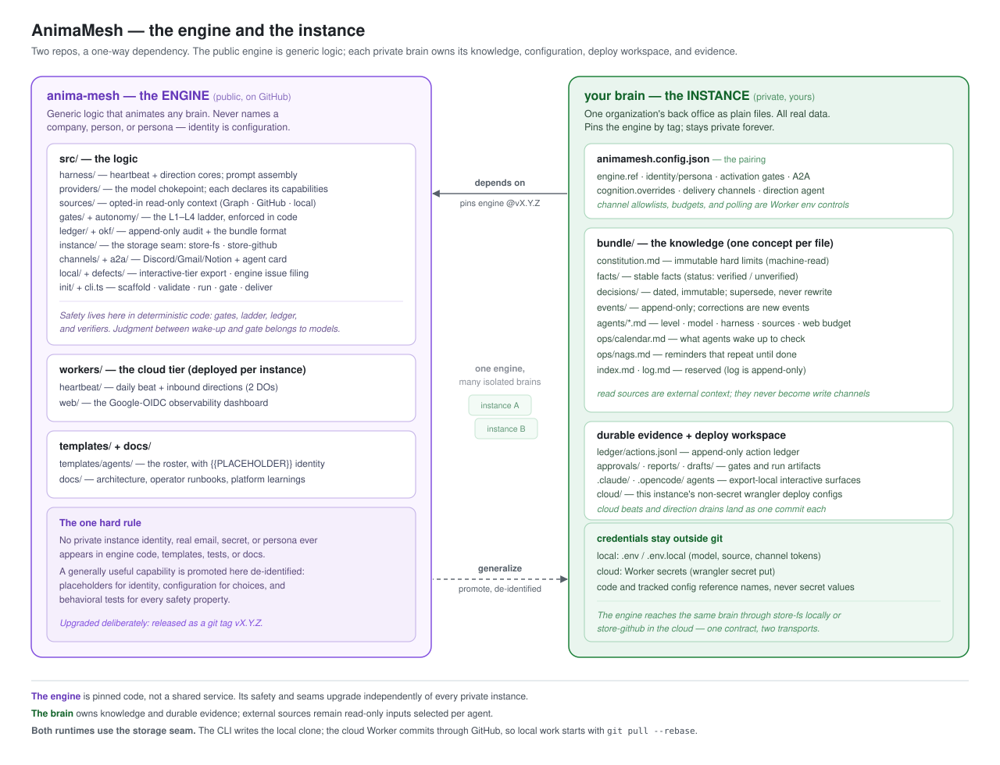
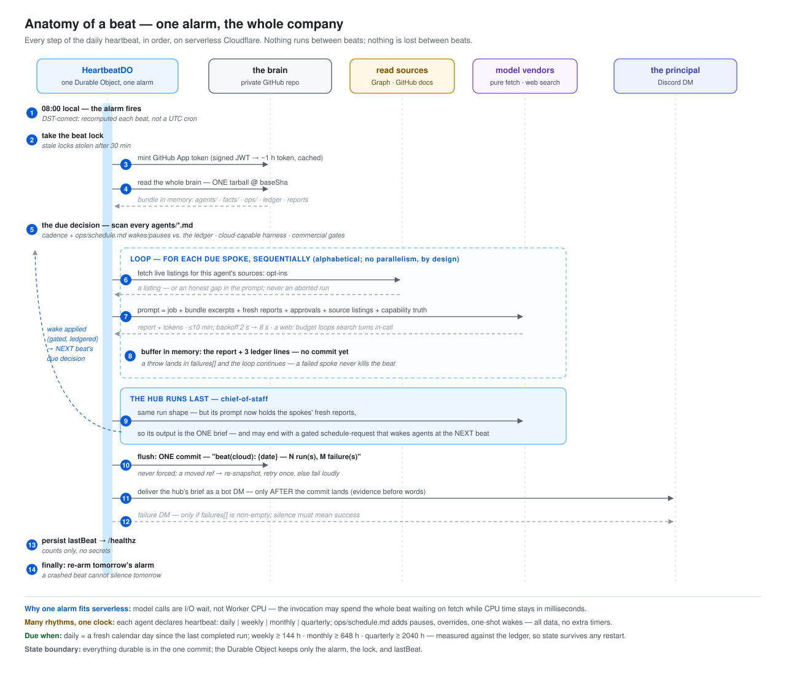

# AnimaMesh @ AI Tinkerers — 2026-08-04

**A company of zero: markdown files, a heartbeat, and an agent mesh that
runs a real business.** This page is the talk — diagram, then the code
behind it, five times. Every link is in this public repo; the running
production instance is private, so the code stops here are
[sample-brain](README.md), a scrubbed copy of it that validates and runs.

---

## 1 · A company is two repos



*Themes:* the public **engine** (this repo) holds every mechanism; a
private **brain** holds everything that makes it one particular company.
The dependency is one-way — the brain pins the engine by tag; the engine
never knows the company exists. And the roster is the company's choice:
agents are data in the brain, picked from shipped archetypes or written
fresh — we'll come back to that at stop 5.

*Code:*

- [animamesh.config.json](animamesh.config.json) — the pin (`engine.ref`),
  the identity, the activation gates. The whole coupling is this file.
- [bundle/index.md](bundle/index.md) — the brain's own map: "How a day
  works" in six steps.

## 2 · The brain is markdown — OKF, one concept per file


*Themes:* the bundle follows **OKF**: one concept per markdown file, YAML
frontmatter with a required `type`, two reserved files (`index.md` the
map, `log.md` the story). Why we chose it: the same file is equally
legible to a human, an agent, and a validator — no database, no admin UI,
no export problem; one concept per file makes every git diff a meaningful
unit of change; and typed frontmatter makes the whole brain
machine-checkable (`pnpm cli validate`) without giving up prose. Restart
anywhere; resume from git.

*Code (have these open in tabs):*

- [bundle/constitution.md](bundle/constitution.md) — immutable hard
  limits; enforced by harness code, not by asking nicely.
- [bundle/agents/chief-of-staff.md](bundle/agents/chief-of-staff.md) — an
  agent IS a file: level, model, harness, whitelist, web budget in
  frontmatter; the job in prose.
- [bundle/ops/nags.md](bundle/ops/nags.md) — "bug me daily until I do
  this," as data. Day counts and done-conditions.

## 3 · One beat, end to end



*Themes:* agents are decoupled the way human coworkers are — each works
its own tasks on its own rhythm, nobody blocks anybody — but they share
one workspace: the repo. Once a day, every due agent gets ONE prompt —
job + bundle + fresh reports + what its runtime actually grants — writes
one report, and the repo diff is the audit. Everything is mediated by
files, which is exactly what puts the human in the loop at **fractional
time**: the founder spends minutes a day disposing (writes are propose →
dispose — a fenced block in the report, a whitelist gate in code, a
ledger line), not hours supervising. It runs on the cloud by default, and
the same brain runs on a laptop — the bundle is the only state.

*Code:*

- [../../src/harness/run-core.ts](../../src/harness/run-core.ts) — prompt
  assembly, capability truth, the verifiers.
- [reports/2026-07-21-chief-of-staff-3f8a2c1d.md](reports/2026-07-21-chief-of-staff-3f8a2c1d.md)
  — a daily brief, ending in a live `schedule-request` block…
- [ledger/actions.jsonl](ledger/actions.jsonl) — …and the ledger lines
  where the harness applied and consumed it.
- [../../src/harness/schedule.ts](../../src/harness/schedule.ts) — the
  gate that decides: model judgment asks, deterministic code disposes.

## 4 · Reach: files, mail, and other repos


*Themes:* AI memory and human memory are more alike than different — you
don't remember every line of a tax return from years past, you remember
**where you put it**. The brain is no different: the cabinet records
where truth lives and what it means, never a copy (the EIN stays in the
letter). So the company's resources never move — the brain goes to them:
documents stay in SharePoint/OneDrive, read **over Microsoft Graph**,
read-only, the live folder listing inlined into every prompt. Graph now
reads the mailbox too — the CRM was **bootstrapped from sent items**
(one-off `Mail.Read` device consent, token never persisted), because
your outbox is the ground truth of your real relationships. And the mesh
isn't confined to its own repo: the cloud tier runs the brain straight
from GitHub, reads sibling repos as sources, commits its beats back, and
**files de-identified issues on this repo when the engine misbehaves** —
the agent is user #1 of its own bug tracker. Deliberately absent: direct
bank access — designed, not wired; money stays behind constitution
gates. (Workers/Durable-Object internals:
[cloud-architecture.svg](../cloud-architecture.svg).)

*Code:*

- [../../src/sources/msgraph.ts](../../src/sources/msgraph.ts) — the Graph
  read; [cabinet/2025-09-22-ein-letter.md](bundle/cabinet/2025-09-22-ein-letter.md)
  — the discipline it enables: record where truth lives, not a copy.
- [../../src/sources/github-docs.ts](../../src/sources/github-docs.ts) —
  a second repo as a read source (local tree on a laptop, GitHub API on
  Workers).
- [bundle/crm/taxonomy.md](bundle/crm/taxonomy.md) +
  [bundle/crm/engagements/2026-harborlight-content-audit.md](bundle/crm/engagements/2026-harborlight-content-audit.md)
  — the CRM the sent-mail sweep feeds: typed concepts, boundary screens
  in the data, hub proposes / founder disposes.
- [../../src/harness/defects.ts](../../src/harness/defects.ts) — the
  defect loop: leak guard, dedup, cap, ledger — then a public issue.
  Exhibit A: [issue #4](https://github.com/jackzhaojin/anima-mesh/issues/4),
  filed by the agent, which became the v0.12 capability-truth release
  ([CHANGELOG](../../CHANGELOG.md)).

## 5 · One engine, many companies


*Themes:* everything you've just seen is generic — a second company is a
new private repo, not a fork. Scaffold it, choose its roster (the choice
from stop 1: nine shipped archetypes, or write your own agent as one
markdown file), pin the engine by tag, upgrade deliberately. The same
validator checks a hand-built brain and the scaffolder's output. And it
runs with zero credentials — the fake provider does the whole loop
offline.

*Code:*

- [../../templates/agents/](../../templates/agents/) — the archetypes.
- [../../src/okf/conformance.ts](../../src/okf/conformance.ts) — the
  conformance rules (reserved files, typed concepts, immutable
  constitution, machine-read schedule).
- Run it, live or at home:

```bash
pnpm cli validate docs/sample-brain
pnpm cli run chief-of-staff --instance docs/sample-brain
```

- [../starting-a-company.md](../starting-a-company.md) — empty directory →
  a mesh running a real company.

---

*Everything in this sample is fictional (Copperline Labs and its people do
not exist); the structure is scrubbed from a production brain that has run
a real company since March 2026.*
