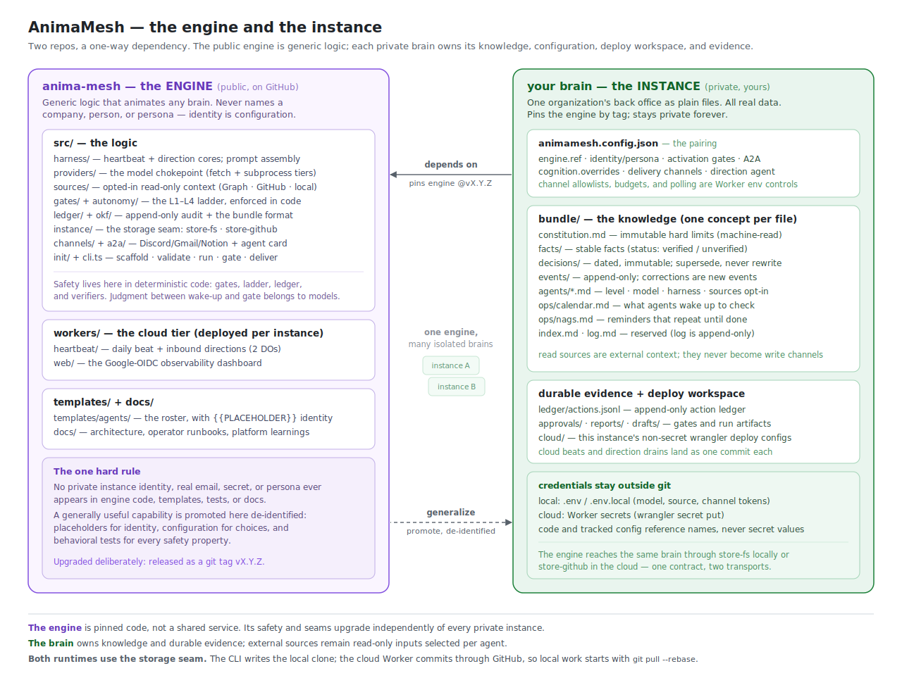

# Starting a company on AnimaMesh

*From an empty directory to a mesh that runs a real company's back office.
The engine is company-agnostic by construction — this is the same path
whether it's your first instance or your fifth. Any capable AI model can
operate this playbook; nothing below assumes a particular assistant.*

## 0. What you're building

One private **brain repo** per company: knowledge as markdown concepts, an
append-only ledger, file-based approvals, and a config that pins this engine
by tag. The engine animates it; you review and approve. Humans do judgment
and signatures; agents do everything preparable.

## The two repos — what's in the engine vs. what's in your brain



AnimaMesh is deliberately split into two repositories with a **one-way
dependency**. Knowing which half owns what is the single most important thing
to understand before you start — the sorting checklist is in
[engine-vs-instance.md](engine-vs-instance.md); this is the shape.

**`anima-mesh` — the engine (public).** All generic logic and nothing else:

| Path | What it holds |
|---|---|
| `src/harness/` | the run loop — heartbeat and direction cores |
| `src/providers/` | the model chokepoint (moonshot-api, anthropic-api, …) |
| `src/sources/` | read-only prompt context (OneDrive/SharePoint, GitHub docs, local working trees) |
| `src/gates/` + `src/autonomy/` | the L1–L4 ladder, enforced in code |
| `src/ledger/` + `src/okf/` | append-only audit + the bundle format |
| `src/instance/` | the storage seam — read a brain from disk *or* GitHub |
| `src/channels/` + `src/a2a/` | Discord/Gmail/Notion delivery + agent card |
| `src/init/` + `src/cli.ts` | scaffold a brain · run · gate · report |
| `workers/heartbeat/` + `workers/web/` | the cloud tier (beat + directions + dashboard) |
| `templates/agents/` | the shipped roster, with `{{PLACEHOLDER}}` identity |
| `docs/` | this shelf |

It **never** names a company, person, persona, real email, or secret. You
pin it by tag and upgrade deliberately; any AI model can read the whole thing
because there's nothing private in it.

**Your brain — the instance (private).** Everything about one company, as
git-tracked plain files:

| Path | What it holds |
|---|---|
| `animamesh.config.json` | the pairing: `engine.ref` pin, `cognition.overrides`, delivery, direction agent, identity/persona, activation gates |
| `bundle/constitution.md` | immutable hard limits (machine-read by the gates) |
| `bundle/facts/ decisions/ events/` | stable / dated-immutable / append-only knowledge |
| `bundle/agents/*.md` | each agent as a concept file (level · model · harness · optional `sources:`) |
| `bundle/ops/calendar.md` + `ops/nags.md` | what agents wake to check + reminders that repeat |
| `bundle/index.md` + `log.md` | reserved (log is append-only) |
| `ledger/actions.jsonl` | the append-only action ledger (audit seam) |
| `approvals/` `reports/` `drafts/` | the "needs you" gate + run artifacts |
| `cloud/` | this company's `wrangler.jsonc` deploy configs |
| `.env.local` | secrets, git-ignored, mode 600 — referenced by name, never committed |

Cloud-only channel controls — sender allowlists, direction budgets, and Gmail
poll cadence — are Worker vars/secrets, not brain knowledge. Keeping that edge
policy in the deploy environment lets the Worker reject or defer input before
any model call.

**Starting company #2** is just a second brain pointed at the same engine
tag — nothing is shared between companies, and nothing carries over except
everything you've taught the engine.

### Staying in sync — both runtimes write to your brain

The engine runs your brain from **two places over the same files** (the
storage seam): the **laptop CLI** over a local clone, and the **cloud Worker**
over the GitHub copy. Both are writers — a cloud beat or an emailed/Discord
direction lands as a commit authored by the mesh (e.g. `animamesh-cloud`),
pushed straight to your brain repo. So your local clone goes stale on its own:

```bash
git pull --rebase --autostash        # before you work — pick up what the cloud wrote
git log --author=<mesh-identity>     # what ran while you were away
```

The two writers coexist safely: the CLI pulls `--rebase` before committing,
and the cloud store appends one commit per run and **never force-pushes**. If
you skip the pull, your next local commit just has to rebase over the cloud's
— harmless, but pulling first keeps history clean.

## 1. Scaffold the brain

```bash
pnpm cli init ../acme-brain --org "Acme Co" --principal "Ada" \
  --agents compliance-ops,chief-of-staff
pnpm cli validate ../acme-brain        # must PASS before anything runs
```

The init interviews you (or takes flags / an answers file), fills the agent
templates, and emits a conformant bundle: `constitution.md` (the immutable
hard limits), `facts/`, `decisions/`, `events/`, `ops/calendar.md`,
`agents/*.md`. Make it a **private** git repo immediately — the brain will
hold real corporate facts. Never let it live inside a cloud-synced folder.

House rules that keep the bundle trustworthy as it grows:

- One concept per file; corrections to events are new events; superseded
  decisions are new dated decisions. `log.md` is append-only.
- Facts carry `status:` — an unverified fact is a lead, not something to
  file with the government. Verify against source documents before relying
  on it, and never state a corporate fact from model recall: read the
  concept.
- The constitution is edited by the principal, by hand, with a decision
  entry — never by an AI session.

## 2. First runs, locally

```bash
pnpm cli run compliance-ops --instance ../acme-brain
pnpm cli report --instance ../acme-brain
pnpm cli gate list --instance ../acme-brain
```

Every agent starts at **L1 (report-only)**: the harness writes the report,
appends the ledger, and runs the verifiers — the agent itself causes no side
effects. Promotion up the autonomy ladder (L2 draft-for-approval, L3
whitelisted reversible actions, L4 gated external actions) is a frontmatter
edit with git history: trust as an operational dial with a paper trail.

## 3. Choose cognition

Each agent's concept declares `model` + `harness`. Mix freely: an expensive
model for the chief of staff, a cheap one for a watcher. Two rules learned
the hard way:

- If an agent should ever run in the cloud, its **effective** harness must
  be pure-fetch (`CLOUD_HARNESSES`) — and probe the vendor endpoint from a
  real Worker before committing to it ([learnings](learnings/README.md)).
- Route around vendor trouble with `animamesh.config.json →
  cognition.overrides` (declared harness → actually-executed harness) —
  a config edit, not an agent rewrite, and reversible by deleting the block.

For live document context, add `sources: [onedrive]`,
`sources: [github-docs]`, or both to only the agents that need it. The harness
inlines a current read-only listing during prompt assembly. A missing or failed
source is surfaced as an explicit context gap and does not abort the run. The
current prompt surface includes listing metadata, not document bodies.

## 4. Connect the principal

- **Delivery** (`delivery` in config): where the daily brief lands —
  Discord bot DM, Notion page, Gmail, or console while you're bootstrapping.
- **Directions**: give the persona a Discord app and the principal can
  message the mesh directly; a polled Gmail inbox does the same for email.
  Inbound is sender-gated, budget-capped, and read *agentically* — the
  agent decides the disposition, no keyword commands to memorize.
- **Nags**: `ops/nags.md` entries repeat in every brief, with age, until
  done — the mesh politely refuses to let you forget your own blockers.

## 5. Go to the cloud

Follow [deploying-cloud.md](deploying-cloud.md). From then on the mesh runs
with the laptop closed: daily beat, one evidence commit, brief in your DMs.
Keep the CLI around — it's the same engine over the same repo, useful for
manual runs and as home for subprocess-only harnesses.

## 6. Operate

The daily rhythm is: **read the brief → approve or deny gates → answer or
issue directions → sign what needs signing.** Observability is git first
(`git log --author=<mesh-identity>`), the dashboard for at-a-glance state,
`/healthz` for liveness. When something breaks, the mesh DMs you — silence
must mean success, so verify the silence occasionally (check `/healthz`
after the beat hour).

## 7. Re-aim the company (direction pivots)

Companies change what they are — a consulting shop becomes a product firm,
a research lab picks a commercial model. The bundle is built for this:
**a pivot is one dated decision plus its ripples**, not a rewrite. The
flow, in order:

1. **Decision first.** One new dated file in `bundle/decisions/` stating
   the new direction, what it refines or supersedes (link the old
   decision), and — just as important — what is *explicitly not yet
   decided*. Recording open questions honestly keeps agents from treating
   an aspiration as a fact.
2. **Ripple to facts.** Update the strategic-posture line(s) in `facts/`
   to point at the decision. Never rewrite history in facts that were
   verified against source documents — only the posture, with a pointer.
3. **Ripple to ops.** Re-aim `ops/watch-list.md` at the new focus areas;
   open `ops/nags.md` entries for the human-owned follow-through the pivot
   creates (the business plan, the pitch, the website — documents always
   lag identity).
4. **Ripple to agents.** Re-focus the agent concept files whose duties the
   pivot changes (a research agent's subjects, a chief of staff's framing).
   Frontmatter and duties are editable; the git history is the promotion
   record.
5. **Log and validate.** One append-only `log.md` entry telling the story,
   then `pnpm cli validate` must stay PASS before committing.

Because both runtimes read the same repo, the entire mesh operates under
the new identity from the next heartbeat — no redeploy, no config change.
That is the payoff of keeping identity in the bundle instead of in code.

## 8. Evolve

- Capabilities built inside the brain for expedience get flagged
  **"generalize me"** and later promoted into the engine, de-identified —
  the checklist is in [engine-vs-instance.md](engine-vs-instance.md).
- Engine upgrades are deliberate: the brain pins a tag; upgrading = bump
  `engine.ref`, redeploy, note it in the log. Patch tags carry fixes worth
  reading ([learnings/](learnings/README.md)).
- The second company starts at step 1 with the same engine — nothing from
  the first company carries over except everything you taught the engine.
